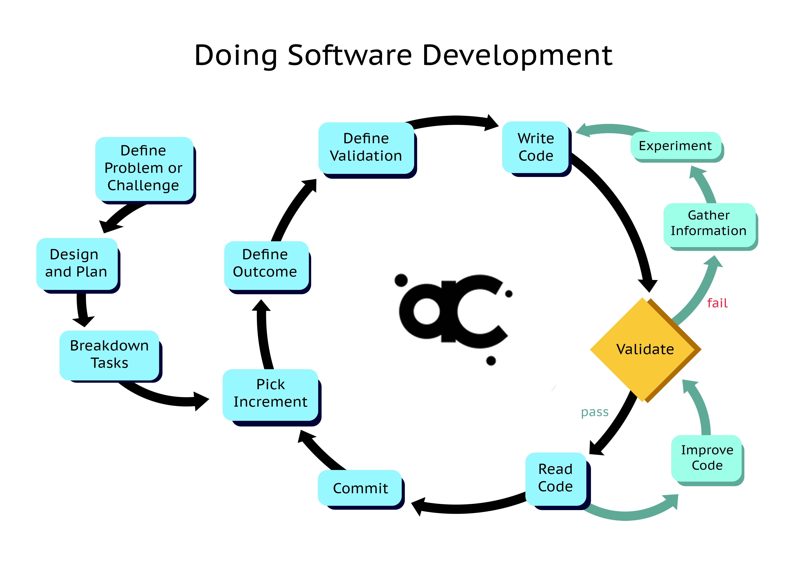

# JavaScript Review

## Agenda

* format
* reminders
* node
* npm
* jest
* review
* array methods

## Format

* class time from 9am - 12pm
  * lecture and work on small solo exercises
  * create a repo for each class day
  * complete exercises in new branches
* Lab time from 1pm - 6pm
  * independent/pair/mob work on larger lab
  * create a new repo for each lab

## Reminders

* It's going to be hard and that's ok.
  * Just because its hard doesn't mean you can't do it.
* It's going to feel awkward.
  * riding a bike
  * swimming
  * playing an instrument
  * rock climbing
  * etc.

## Labs

* commit a lot
* travis must pass

## Working Code vs Maintainable Code

Code for humans!

* consistency (eslint)
* naming
  * stick to conventions
  * don't abbreviate
  * reduce redundancy
* be expressive
* keep indentation low
* extract logic into functions
* keep functions short



## Node

Node is a JavaScript runtime.

```sh
node index.js
```

## NPM

Node Package Manager (npm) is a registry of JavaScript packages. We can use
npm to download open source JavaScript modules and use that functionality
in our own applications.

```sh
npm i -D jest eslint
```

## jest

We'll be using jest to run our tests.

```js
// require stuff at the top

// give your tests a name
// this represents the module you are testing
describe('My test suite', () => {

  // give each test a name
  // this represents a feature of your module
  it('does stuff', () => {
    expect(result).toEqual(expected);
  });
});
```

## Review

* primitives
* operators
* statements
* objects
* destructuring
* rest and spread
* loops
* array methods

### Primitives

* null
* undefined
* number
* string
* boolean
* bigint
* symbol

### Operators

* arithmetic
* assignment
* comparison
* logical
* ternary
* delete
* in

### Statements

* smallest building block

### Objects

Objects are key/value pairs of properties. Values in an object can
be accessed via theirs keys.

```js
const dog = { name: 'rover', age: 5, weight: '20lbs' };

// dot notation
console.log(dog.name); // prints rover
```

```js
const dog = { name: 'rover', age: 5, weight: '20lbs' };

// bracket notation
console.log(dog['name']); // prints rover
```

```js
const dog = { name: 'rover', age: 5, weight: '20lbs' };

// dot notation
dog.name = 'spot'
console.log(dog); // prints { name: 'spot', age: 5, weight: '20lbs' }
```

```js
const dog = { name: 'rover', age: 5, weight: '20lbs' };

// dot notation
dog['name'] = 'spot'
console.log(dog); // prints { name: 'spot', age: 5, weight: '20lbs' }
```

```js
const key = 'name';
const dog = { name: 'rover', age: 5, weight: '20lbs' };
console.log(dog[key]); // prints rover
```

```js
const key = 'name';
const dog = { name: 'rover', age: 5, weight: '20lbs' };
dog[key] = 'spot'

console.log(dog); // prints { name: 'spot', age: 5, weight: '20lbs' }
```

```js
const dog = { name: 'rover', age: 5, weight: '20lbs' };
const hasName = 'name' in dog;
const hasColor = 'color' in dog;

console.log(hasName); // prints true
console.log(hasColor); // prints false
```

We can get all keys in an object:

```js
const dog = { name: 'rover', age: 5, weight: '20lbs' };
const keys = Object.keys(dog);

console.log(keys); // prints ['name', 'age', 'weight']
```

We can get all values from an object:

```js
const dog = { name: 'rover', age: 5, weight: '20lbs' };
const values = Object.values(dog);
console.log(values); // prints ['rover', 5, '20lbs']
```

```js
const dog = { name: 'rover', age: 5, weight: '20lbs' };
const entries = Object.entries(dog);

console.log(entries); // [['name', 'rover'], ['age', 5], ['weight', '20lbs']]
```

### Destructuring

```js
const dog = { name: 'rover', age: 5, weight: '20lbs' };
const { name } = dog; //
console.log(name); // prints rover
```

```js
const dog = { name: 'rover', age: 5, weight: '20lbs' };
const { name, age } = dog; //
console.log(name, age); // prints rover 5
```

```js
const dog = { name: 'rover', age: 5, weight: '20lbs' };
const { name: dogName, age } = dog; //
console.log(dogName, age); // prints rover 5
```

```js
const dog = { name: 'rover', age: 5, weight: '20lbs' };
const { name, color = 'red' } = dog; //
console.log(dogName, color); // prints rover red
```

```js
const dog = { name: 'rover', age: 5, weight: '20lbs', color: 'blue' };
const { name, color = 'red' } = dog; //
console.log(dogName, color); // prints rover blue
```

```js
const numbers = [1, 2, 3, 4, 5];
const [one, two, three, four, five] = numbers; //
console.log(one, three); // prints 1 3
```

```js
const numbers = [1, 2, 3, 4, 5];
const [one, two] = numbers; //
console.log(one, two); // prints 1 2
```

```js
const numbers = [1, 2, 3, 4, 5];
const [one,,huh] = numbers; //
console.log(one, huh); // prints 1 3
```

### Rest and Spread

#### Rest

```js
function things(...args) {
  console.log(args)
}

things('hi', 'there', 'you'); // prints ['hi', 'there', 'you']
```

```js
const dog = { name: 'rover', age: 5, weight: '20lbs' };
const { name, ...rest } = dog;
console.log(rest) // prints { age: 5, weight: '20lbs' }
```

```js
const dog = { name: 'rover', age: 5, weight: '20lbs' };
const { age, ...othersStuff } = dog;
console.log(othersStuff) // prints { name: 'rover', weight: '20lbs' }
```

```js
const dog = { name: 'rover', age: 5, weight: '20lbs' };
const { weight, ...noWeight } = dog;
console.log(noWeight) // prints { name: 'rover', age: 5 }
```

```js
const dog = { name: 'rover', age: 5, weight: '20lbs' };
const { ...huh } = dog;
console.log(huh) // prints { name: 'rover', age: 5, weight: '20lbs' }

// What's happening here?
dog.name = 'spot'

console.log(dog);
console.log(huh);
```

```js
const numbers = [1, 2, 3, 4];
const [one, ...rest] = numbers;
console.log(rest) // prints [2, 3, 4]
```

```js
const numbers = [1, 2, 3, 4];
const [one,, ...rest] = numbers;
console.log(rest) // prints [3, 4]
```

```js
// How would you copy an array using rest?
```

#### Spread

```js
const dog = { name: 'rover', age: 5, weight: '20lbs' };
const dogWithColor = { ...dog, color: 'red' };

console.log(dogWithColor); // prints { name: 'rover', age: 5, weight: '20lbs', color: 'red' }
```

```js
const dog = { name, 'rover', age: 5, weight: '20lbs' };
const dogClone = { ...dog };

console.log(dogClone); // prints { name: 'rover', age: 5, weight: '20lbs' }
```

```js
const dog = { name, 'rover', age: 5, weight: '20lbs' };
const dogClone = { ...dog, name: 'spot' }; // prints { name: 'spot', age: 5, weight: '20lbs' }

console.log(dogClone);
```

```js
const numbers = [1, 2, 3];
const moreNumbers = [...numbers, 4, 5];

console.log(moreNumbers) // prints [1, 2, 3, 4, 5]
```

```js
const numbers = [1, 2, 3];
const moreNumbers = [-1, 0, ...numbers];

console.log(moreNumbers); // prints [-1, 0, 1, 2, 3]
```

```js
const numbers = [1, 2, 3];
const numbersClone = [...numbers];

console.log(numbersClone); // prints [1, 2, 3]
```

### Loops

#### for

* break
* continue
* for/of
* for/in

```js
for(let i = 0; i < 10; i++) {
  console.log(i);
  break;
}

// What would you expect to see?
```

```js
for(let i = 0; i < 10; i++) {
  if(i === 0) continue;
  console.log(i);
}

// What would you expect to see?
```

```js
const numbers = [1, 2, 3, 4];
for(let i of numbers) {
  console.log(i);
}

// What would you expect to see?
```

```js
const obj = { one: 1, two: 2, three: 3, four: 4 };
for(let i in obj) {
  console.log(i);
}

// What would you expect to see?
```

#### while

```js
let 5 = 0;
while (n < 5) {
  console.log(n++);
}
```

### Arrays

```js
const numbers = [1, 2, 3, 4];
console.log(numbers[0]); // prints 1
console.log(numbers[1]); // prints 2
console.log(numbers[2]); // prints 3
console.log(numbers[3]); // prints 4
```

#### forEach

```js
const numbers = [1, 2, 3, 4];
numbers.forEach(number => console.log(number));
```

#### map

```js
const numbers = [1, 2, 3, 4];
const double = numbers.map(number => number * 2);

console.log(double); // prints [2, 4, 6, 8]
```

#### filter

```js
const numbers = [1, 2, 3, 4];
const even = numbers.filter(number => number % 2 === 0);

console.log(even); // prints [2, 4]
```

#### find

```js
const numbers = [1, 2, 3, 4];
const found = numbers.find(number => number % 2 === 0);

console.log(found); // prints 2
```

#### some

```js
const numbers = [1, 2, 3, 4];
const anyEven = numbers.some(number => numbers % 2 === 0);

console.log(anyEven); // prints true
```

#### every

```js
const numbers = [1, 2, 3, 4];
const allEven = numbers.every(number => numbers % 2 === 0);

console.log(allEven); // prints false
```

#### reduce

```js
const numbers = [1, 2, 3, 4];
const sum = numbers.reduce((acc, number) => {
  acc += number;
  return acc;
});

console.log(sum); // prints 10
```

```js
const sentence = 'Hi everyone';
const letterCount = sentence
  .split('').reduce((counts, letter) => {
    // if letter hasn't been seen yet, initialize it to 0
    if(!(letter in counts)) counts[letter] = 0;

    // increment the count of letter
    counts[letter]++;
    return counts;
  }, {});

console.log(letterCount);
```
